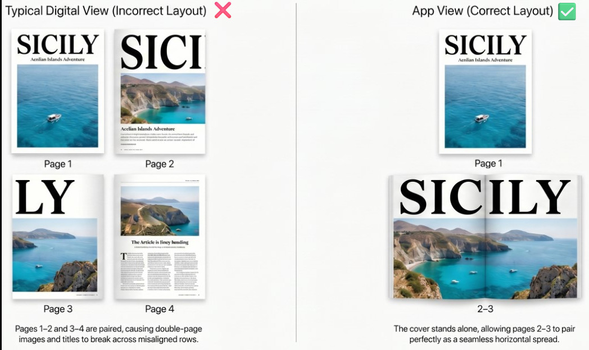

# PdfMagazineViewer
Android PDF Magazine Viewer

## Overview
PdfMagazineViewer is an Android application for reading PDF magazines with an optimized editorial layout.

The goal is to provide a reading experience closer to printed magazines, with:
- single cover page handling
- 2-page spread layout (2-3, 4-5, ...)
- consistent and predictable pagination

Example:

## Project Status
This project is still in its initial setup phase.
There is no consolidated source code committed yet.

